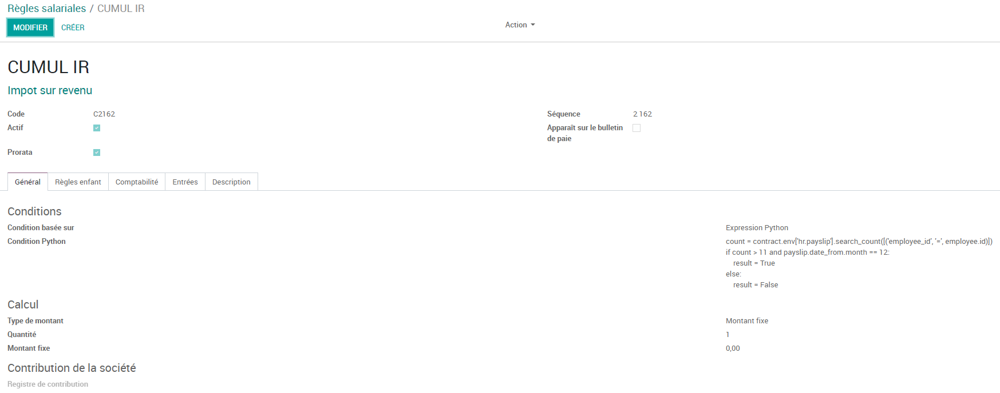
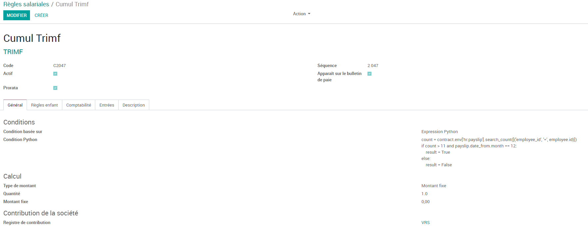
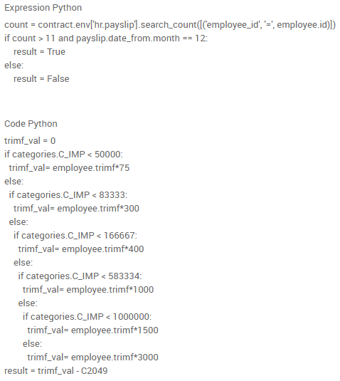

# IMPLEMENTATION DE L'IR REGUL ANNUEL

# Desciption da la fonctionnalité

Régularisation IR annuel

- calcul effectué au mois de décembre de chaque année

- concerne l'IR

- condition : salarié présent sur 12 mois (12 bulletins)

- après calcul IR du mois, on recalcule l'IR sur la base du brut imposable annuel et on compare avec l'IR calculé par Odoo. 

- IR Régul annuel = IR recalculé en décembre - IR cumulé dans Odoo

- Impôt sur le revenu du mois = IR avant régul du mois - IR régul annuel

# Implementation

on a crée trois régles salariales à savoir:
### IR ANNUEL

Permet de recalculer l'ir sur une base annuelle.

avec une condition python et un montant fix.
le calcul se fait dans le code en prenant comme base le brut imposable annuel.

- Condition:
bulletin du mois de decembre et l'employé doit avoir au moins 12 bulletins y compris celui de decembre.

### CUMUL IR

Permet de récuperer le cumul de l'ir généré par Odoo depuis le mois de janvier de l'année.

avec une condition python et un montant fix.
calculé depuis les code, on fait le cumul de l'ir généré par Odoo

- Condition:
bulletin du mois de decembre et l'employé doit avoir au moins 12 bulletins y compris celui de decembre.

### REGUL IR ANNUEL

Permet de déterminer la valeur de la régualrisation de l'ir.

avec une condition python et un code python.

- Condition python:

    bulletin du mois de decembre et l'employé doit avoir au moins 12 bulletins y compris celui de décembre.

- Code python:

    result = C2162 - C2161

    NB:
    
    C2162 : retourne le montant de l'ir annuel
    
    C2161 : retourne la valeur du cumul de l'ir

A la fin, l'ir du mois (Impot sur le revenu) va etre la différence entre l'ir (IR) généré du mois et l'ir regul annuel(REGUL IR ANNUEL).

# IMPLEMENTATION DE LA TRIMF REGUL ANNUEL

Régularisation TRIMF annuelle

- calcul effectué au mois de décembre de chaque année

- condition : salarié présent sur 12 mois (12 bulletins)

- après calcul TRIMF du mois, on recalcule la TRIMF sur la base du brut imposable annuel et on compare avec la TRIMF calculé par Odoo. 

- TRIM régul annuelle = TRIM Recalculé en décembre - IR cumulé dans Odoo

- TRIMF sur le revenu = TRMF avant régul du mois - TRIMF régul annuel

# Implementation

Pour la régularisation de la trimf, on a crée quatre régles salariale à savoir:

### Cumul Trimf
Permet de récuperer le cumul de la trimf généré depuis le mois de janvier de l'année courante.

avec une condition python et un montant fix(le calcul se fait dans les codes)

- condition python

bulletin du mois de decembre et l'employé doit avoir au moins 12 bulletins y compris celui de décembre.

### Trimf Annuelle

Permet de recalculer la trimf en prenant le brut imposable annuel.

avec une condition python et un montant fix(le calcul se fait dans les code)

- condition python

bulletin du mois de decembre et l'employé doit avoir au moins 12 bulletins y compris celui de décembre.

### Regul trimf

Permet de calculer le montant de la régularisation de la trimf.

pour son implementation, on a défini une condition et un code python

- condition python

bulletin du mois de decembre et l'employé doit avoir au moins 12 bulletins y compris celui de décembre.

- code python

    result = C2048 - C2047

    NB:
    
    C2048 : retourne la valeur de la trimf annuel 
    
    C2047 : retourne la valeur du cumul trimf

### Trimf

c'est le jumeau de la trimf existante avec une naissance un peu décalé :-).
Comme tout les jumeaux si on les regarde bien, on finira par décelé quelques differences.

Pour notre cas la diférrence se trouve au niveau de la condition python et du code python.

- condition python

bulletin du mois de decembre et l'employé doit avoir au moins 12 bulletins y compris celui de décembre.

- code python

On calcul la trimf du mois ensuite on défalque le montant de la régularisation de la trimf (regul trimf)

